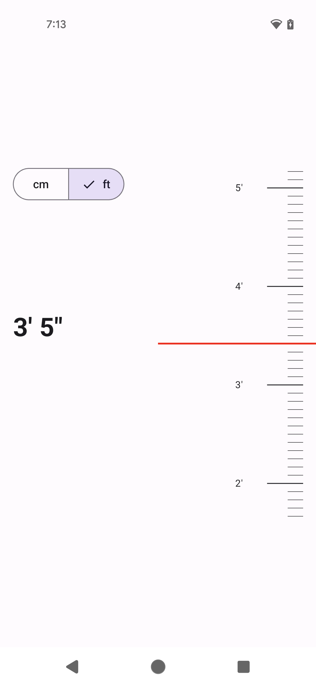
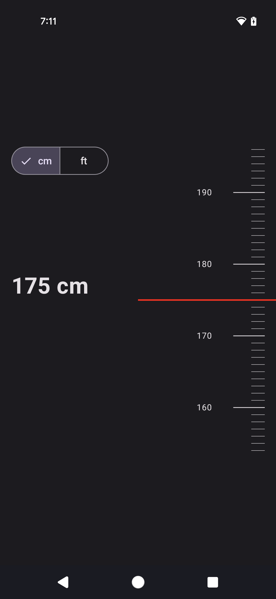
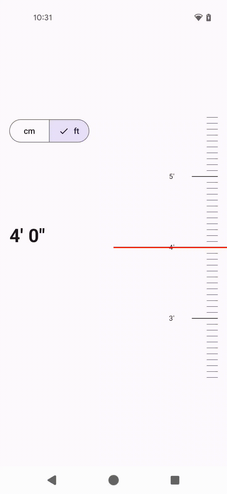

# Ruler-Scale-Compose

[](https://developer.android.com/)
[](https://developer.android.com/jetpack/compose)
[](LICENSE)

A Jetpack Compose component that displays a vertical ruler with selectable **cm** and **ft** units,
complete with a needle indicator and haptic feedback.

## Features

- Scrollable vertical scale with major and minor tick marks.
- Switch between **cm** and **ft/inch** units.
- Real-time value updates via callback.
- Supports dark and light themes.
- Haptic feedback on value change.

## Screenshots

### Light Mode



### Dark Mode



**GIF Preview:**



## Usage

```kotlin
RulerScaleWithNeedle(
    onValueChange = { value, unit ->
        // Handle selected value here
    }
)
